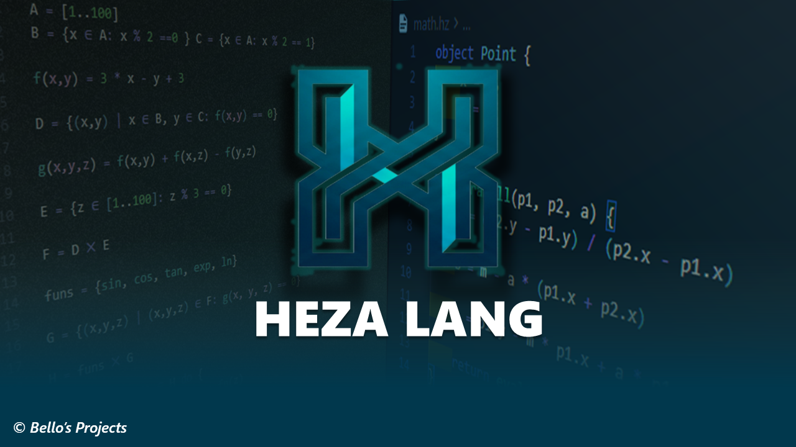
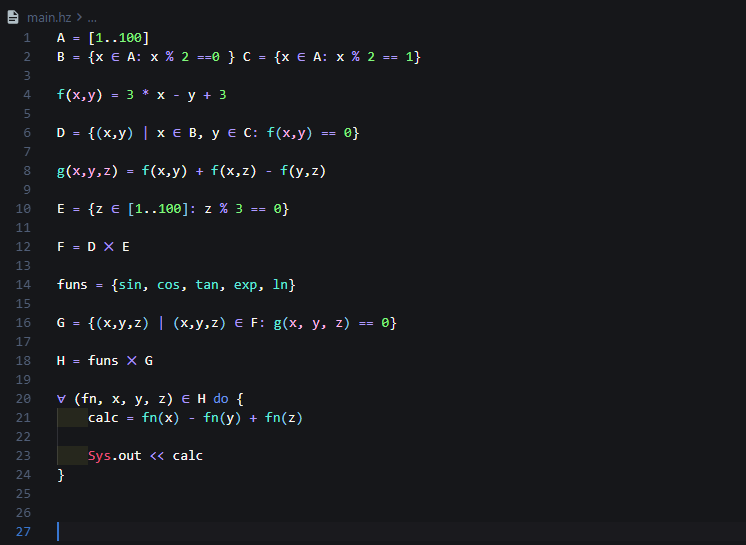
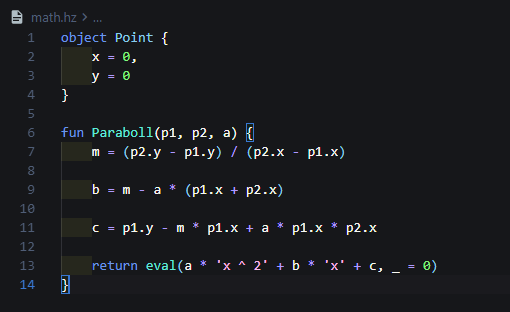

# Heza Support para Visual Studio Code

Soporte de lenguaje para [Heza](https://github.com/bellosprojects/Heza-Lang), un lenguaje de programación orientado a algoritmos, matemáticas y expresiones simbólicas.

[](https://github.com/bellosprojects/heza-support)
[](https://bellosprojects.github.io/Heza-Lang/)
[](https://code.visualstudio.com/)



## Qué aporta

Heza Support convierte VS Code en un entorno de trabajo para archivos `.hz`: combina resaltado de sintaxis, un servidor de lenguaje dedicado y herramientas para ejecutar el programa sin salir del editor.



### Características principales

| Área | Incluye |
| --- | --- |
| Edición | Detección automática de `.hz`, pares de brackets, comentarios con `~`, autocierre y selección envolvente |
| Sintaxis | Resaltado de palabras clave, funciones, objetos, números, strings, comentarios y operadores matemáticos |
| LSP | Diagnósticos en tiempo real, autocompletado contextual, hover, ayuda de firma, ir a definición, símbolos del documento y resaltado semántico |
| Análisis | Identificadores no declarados, uso antes de la declaración y variables no utilizadas |
| Matemáticas | `∑`, `∏`, `∫`, `∂`, `√`, `∀`, `∃`, `∈`, `∪`, `∩`, `→`, `¬`, `∧`, `∨` y más |
| Productividad | Snippets para funciones, condicionales, bucles, objetos, módulos y expresiones matemáticas |
| Ejecución | Comando **Ejecutar script Heza**, botón en el título del editor, menú contextual y `Ctrl+F5` |

## Instalación del Interprete

1. Descarga el interprete desde [Heza Lang](https://github.com/bellosprojects/heza-support/releases).
2. Instalalo.
3. Abre VS Code y crea un archivo main.hz.
4. Empieza a Programar

## Documentación

Puedes visitar la [Web Oficial de Heza](https://bellosprojects.github.io/Heza-Lang/) para obetener mas detalles y la documentacion detallada

## Primeros pasos

1. Crea o abre un archivo con extensión `.hz`.
2. Escribe `fun` o `summation` y selecciona un snippet.
3. Pasa el cursor sobre un símbolo, usa `Ctrl+Click` para ir a su definición o escribe `(` para ver la firma.
4. Ejecuta el archivo con `Ctrl+F5`, el botón de reproducción del editor o el comando **Ejecutar script Heza**.

```heza
fun main() {
    conjunto = {1, 2, 3, 4, 5}
    suma = ∑(i ∈ conjunto, i^2)
    Sys.out << suma
}
```

## Ejemplos de Heza

### Conjuntos, filtros y bucles

```heza
pares = {n | n ∈ [0..10], n % 2 == 0}

∀ i ∈ pares do {
    Sys.out << i
}
```

### Funciones, objetos y módulos

```heza
fun distancia(x, y) {
    return √(x^2 + y^2)
}

object Punto {
    x = 0,
    y = 0
}

use "math" as math
```



## Comandos

| Acción | Cómo usarla |
| --- | --- |
| Ejecutar el archivo Heza activo | `Ctrl+F5` |

## Desarrollo y depuración

La extensión ejecuta el servidor LSP compilado; quienes instalan la extensión no necesitan Python. Para depurar desde el código fuente o crear el paquete de Windows:

1. Instala las dependencias de la extensión con `npm install`.
2. Instala Python y las dependencias de compilación: `python -m pip install -r requirements.txt pyinstaller`.
3. Abre el proyecto en VS Code y selecciona **Run Heza Support Extension** en **Run and Debug**. La tarea previa compila el bundle de la extensión y el servidor con PyInstaller.
4. Para crear un VSIX, ejecuta `npm run build` y luego `npx @vscode/vsce package`. El hook de preempaquetado también ejecuta la compilación automáticamente.

El VSIX de Windows debe incluir `server/dist/HezaLSP.exe`; la compilación genera ese archivo antes del empaquetado. Para revisar errores del servidor, abre **Output > Heza Language Server**.


## Estado y soporte

Heza Support está evolucionando junto con el lenguaje Heza. Si encuentras un error o quieres proponer una mejora, abre un [issue](https://github.com/bellosprojects/heza-support/issues) incluyendo:

- versión de VS Code y del sistema operativo;
- versión de la extensión;
- versión de Heza;
- un ejemplo mínimo que reproduzca el problema;
- el mensaje del panel **Output** cuando corresponda.

Consulta el [CHANGELOG](CHANGELOG.md) para conocer los cambios de cada versión.